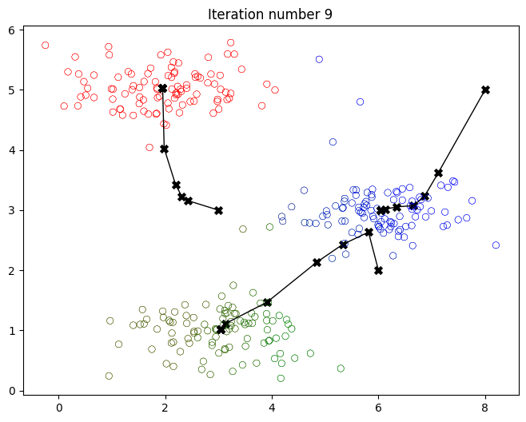
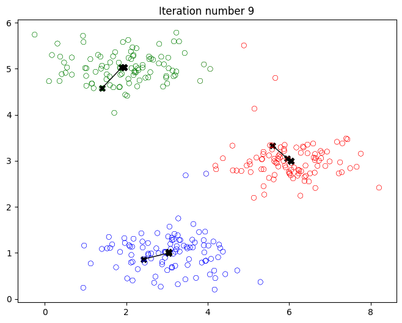
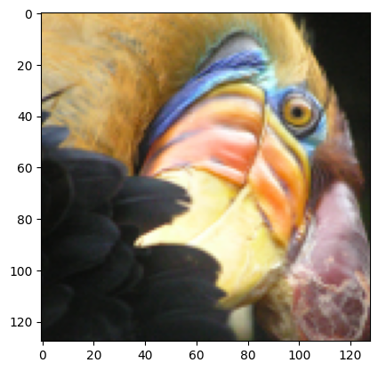
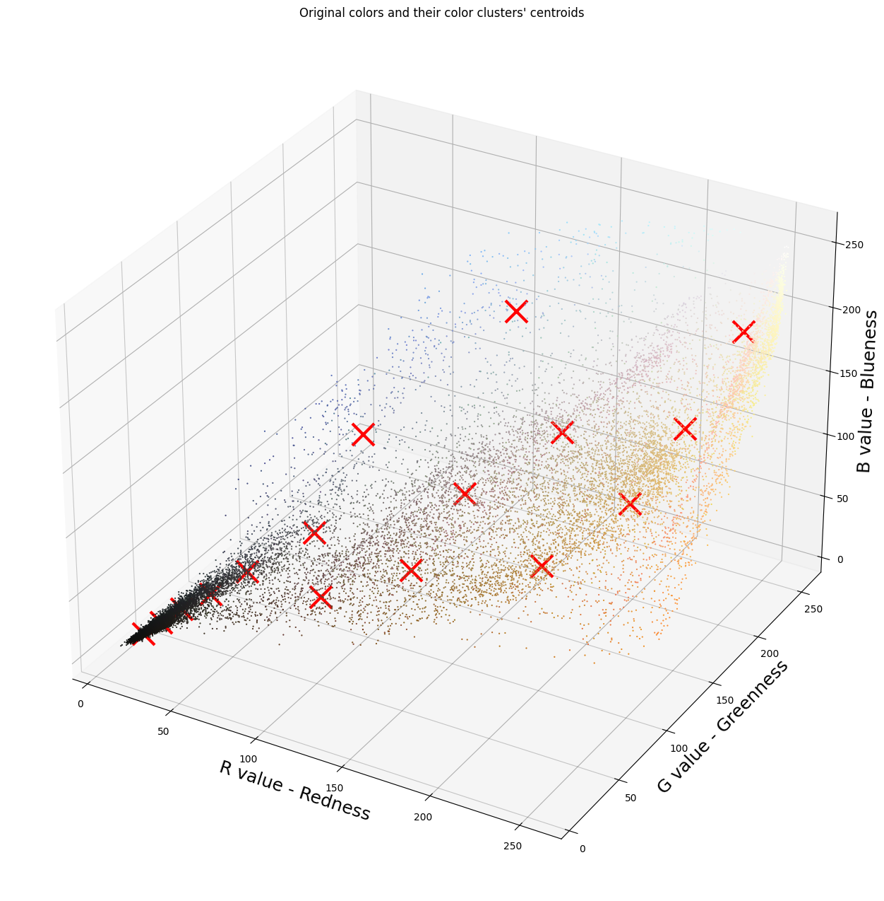
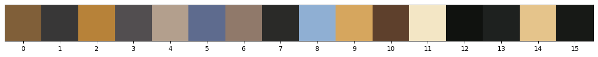
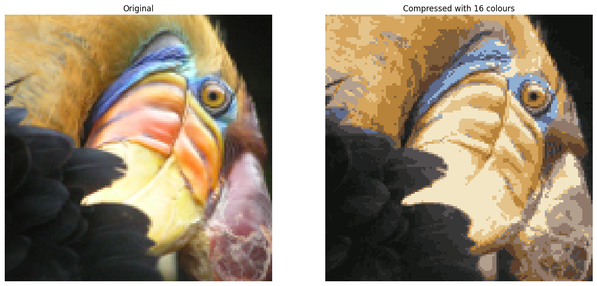

# K-means Clustering 

Here, I implemented the K-means algorithm and used it for image compression. 

I started with a sample dataset that helped me gain an intuition of how the K-means algorithm works. After that, I used the K-means algorithm for image compression by reducing the number of colors that occur in an image to only those that are most common in that image.

First I imported all the packages that I needed, including numpy (the fundamental package for scientific computing with Python), matplotlib (a popular library to plot graphs in Python) and``utils.py`` contains helper functions for this assignment.

```python
import numpy as np
import matplotlib.pyplot as plt
from utils import *

%matplotlib inline
```

## Implementing K-means

The K-means algorithm is a method to automatically cluster similarn data points together. Concretely, I was given a training set $\{x^{(1)}, ..., x^{(m)}\}$, and I wanted to group the data into a few cohesive “clusters”. K-means is an iterative procedure that starts by guessing the initial centroids, and then refines this guess by repeatedly assigning examples to their closest centroids, and then recomputing the centroids based on the assignments.

In pseudocode, the K-means algorithm is as follows:

    ``` python
    # Initialize centroids
    # K is the number of clusters
    centroids = kMeans_init_centroids(X, K)
    
    for iter in range(iterations):
        # Cluster assignment step: 
        # Assign each data point to the closest centroid. 
        # idx[i] corresponds to the index of the centroid 
        # assigned to example i
        idx = find_closest_centroids(X, centroids)

        # Move centroid step: 
        # Compute means based on centroid assignments
        centroids = compute_centroids(X, idx, K)
    ```

The inner-loop of the algorithm repeatedly carries out two steps: 1. Assigning each training example $x^{(i)}$ to its closest centroid, and 2. Recomputing the mean of each centroid using the points assigned to it. 
    
The $K$-means algorithm will always converge to some final set of means for the centroids. However, the converged solution may not always be ideal and depends on the initial setting of the centroids. Therefore, in practice the K-means algorithm is usually run a few times with different random initializations. One way to choose between these different solutions from different random initializations is to choose the one with the lowest cost function value (distortion).

I implemented the two phases of the K-means algorithm separately. And I start by completing `find_closest_centroid` and then proceed to complete `compute_centroids`.

### Finding closest centroids

In the “cluster assignment” phase of the K-means algorithm, the algorithm assigns every training example $x^{(i)}$ to its closest centroid, given the current positions of centroids. 

I completed the code in `find_closest_centroids`. This function takes the data matrix `X` and the locations of all centroids inside `centroids` .It should output a one-dimensional array `idx` (which has the same number of elements as `X`) that holds the index  of the closest centroid (a value in $\{0,...,K-1\}$, where $K$ is total number of centroids) to every training example.

Specifically, for every example $x^{(i)}$ I set
$$c^{(i)} := j \quad \mathrm{that \; minimizes} \quad ||x^{(i)} - \mu_j||^2,$$
where $c^{(i)}$ is the index of the centroid that is closest to $x^{(i)}$ (corresponds to `idx[i]` in the starter code), and $\mu_j$ is the position (value) of the $j$’th centroid. (stored in `centroids` in the starter code), $||x^{(i)} - \mu_j||$ is the L2-norm


```python
# UNQ_C1
# GRADED FUNCTION: find_closest_centroids

def find_closest_centroids(X, centroids):
    """
    Computes the centroid memberships for every example
    
    Args:
        X (ndarray): (m, n) Input values      
        centroids (ndarray): (K, n) centroids
    
    Returns:
        idx (array_like): (m,) closest centroids
    
    """

    # Set K
    K = centroids.shape[0]

    # You need to return the following variables correctly
    idx = np.zeros(X.shape[0], dtype=int)

    ### START CODE HERE ###
    for i in range(X.shape[0]):
          distance = [] 
          for j in range(centroids.shape[0]):
              norm_ij = np.linalg.norm(X[i] - centroids[j])
              distance.append(norm_ij)

          idx[i] = np.argmin(distance)    
    ### END CODE HERE ###
    
    return idx
```

Then I checked my implementation using an example dataset

```python
# Load data stored in arrays X, y from data folder (ex7data2.mat)
import os
from os.path import dirname, join as pjoin
import scipy.io as sio
data = sio.loadmat(os.path.join('data', 'ex7data2.mat'))
X = data['X']
```

The code below printed the first five elements in the variable `X` and the dimensions of the variable

```python
print("First five elements of X are:\n", X[:5]) 
print('The shape of X is:', X.shape)
```

    First five elements of X are:
     [[1.84207953 4.6075716 ]
     [5.65858312 4.79996405]
     [6.35257892 3.2908545 ]
     [2.90401653 4.61220411]
     [3.23197916 4.93989405]]
    The shape of X is: (300, 2)

```python
# Select an initial set of centroids (3 Centroids)
initial_centroids = np.array([[3,3], [6,2], [8,5]])

# Find closest centroids using initial_centroids
idx = find_closest_centroids(X, initial_centroids)

# Print closest centroids for the first three elements
print("First three elements in idx are:", idx[:3])

# UNIT TEST
from public_tests import *

find_closest_centroids_test(find_closest_centroids)
```

    First three elements in idx are: [0 2 1]
    All tests passed!

### Computing centroid means

Given assignments of every point to a centroid, the second phase of the algorithm recomputes, for each centroid, the mean of the points that were assigned to it.

Then I completed the `compute_centroids` below to recompute the value for each centroid

Specifically, for every centroid $\mu_k$ I setted
$$\mu_k = \frac{1}{|C_k|} \sum_{i \in C_k} x^{(i)}$$ 

 where $C_k$ is the set of examples that are assigned to centroid $k$, and $|C_k|$ is the number of examples in the set $C_k$

Concretely, if two examples say $x^{(3)}$ and $x^{(5)}$ are assigned to centroid $k=2$, then I should update $\mu_2 = \frac{1}{2}(x^{(3)}+x^{(5)})$.

```python
# UNQ_C2
# GRADED FUNCTION: compute_centroids

def compute_centroids(X, idx, K):
    """
    Returns the new centroids by computing the means of the 
    data points assigned to each centroid.
    
    Args:
        X (ndarray):   (m, n) Data points
        idx (ndarray): (m,) Array containing index of closest centroid for each 
                       example in X. Concretely, idx[i] contains the index of 
                       the centroid closest to example i
        K (int):       number of centroids
    
    Returns:
        centroids (ndarray): (K, n) New centroids computed
    """
    
    # Useful variables
    m, n = X.shape
    
    # You need to return the following variables correctly
    centroids = np.zeros((K, n))
    
    ### START CODE HERE ###
    for k in range(K):   
          points = X[idx == k]  
          centroids[k] = np.mean(points, axis = 0)       
    ### END CODE HERE ## 
    
    return centroids
```

Then, I checked my implementation by running the cell below

```python
K = 3
centroids = compute_centroids(X, idx, K)

print("The centroids are:", centroids)

# UNIT TEST
compute_centroids_test(compute_centroids)
```

    The centroids are: [[2.42830111 3.15792418]
     [5.81350331 2.63365645]
     [7.11938687 3.6166844 ]]
    All tests passed!

## K-means on a sample dataset 

After I had completed the two functions (`find_closest_centroids` and `compute_centroids`) above, the next step is to run the K-means algorithm on a toy 2D dataset to help me understand how K-means works. Then I took a look at the function (`run_kMeans`) below to understand how it works. That the code calls the two functions I implemented in a loop.

When I ran the code below, it would produce a visualization that steps through the progress of the algorithm at each iteration. The final centroids are the black X-marks in the middle of the colored clusters. And I could see how these centroids got to their final location by looking at the other X-marks connected to it.

Here, I ran the code provided below

```python
# You do not need to implement anything for this part

def run_kMeans(X, initial_centroids, max_iters=10, plot_progress=False):
    """
    Runs the K-Means algorithm on data matrix X, where each row of X
    is a single example
    """
    
    # Initialize values
    m, n = X.shape
    K = initial_centroids.shape[0]
    centroids = initial_centroids
    previous_centroids = centroids    
    idx = np.zeros(m)
    plt.figure(figsize=(8, 6))

    # Run K-Means
    for i in range(max_iters):
        
        #Output progress
        print("K-Means iteration %d/%d" % (i, max_iters-1))
        
        # For each example in X, assign it to the closest centroid
        idx = find_closest_centroids(X, centroids)
        
        # Optionally plot progress
        if plot_progress:
            plot_progress_kMeans(X, centroids, previous_centroids, idx, K, i)
            previous_centroids = centroids
            
        # Given the memberships, compute new centroids
        centroids = compute_centroids(X, idx, K)
    plt.show() 
    return centroids, idx
```

```python
# Load an example dataset
# X = load_data()

# Set initial centroids
initial_centroids = np.array([[3,3],[6,2],[8,5]])

# Number of iterations
max_iters = 10

# Run K-Means
centroids, idx = run_kMeans(X, initial_centroids, max_iters, plot_progress=True)
```

    K-Means iteration 0/9
    K-Means iteration 1/9
    K-Means iteration 2/9
    K-Means iteration 3/9
    K-Means iteration 4/9
    K-Means iteration 5/9
    K-Means iteration 6/9
    K-Means iteration 7/9
    K-Means iteration 8/9
    K-Means iteration 9/9

  

## Random initialization

In practice, a good strategy for initializing the centroids is to select random examples from the training set.

Here, I should understand how the function `kMeans_init_centroids` is implemented. The code first randomly shuffles the indices of the examples (using `np.random.permutation()`). Then, it selects the first $K$ examples based on the random permutation of the indices. This allows the examples to be selected at random without the risk of selecting the same example twice.

```python
# You do not need to modify this part

def kMeans_init_centroids(X, K):
    """
    This function initializes K centroids that are to be 
    used in K-Means on the dataset X
    
    Args:
        X (ndarray): Data points 
        K (int):     number of centroids/clusters
    
    Returns:
        centroids (ndarray): Initialized centroids
    """
    
    # Randomly reorder the indices of examples
    randidx = np.random.permutation(X.shape[0])
    
    # Take the first K examples as centroids
    centroids = X[randidx[:K]]
    
    return centroids
```

I ran K-Means again but this time with random initial centroids. I Ran the cell below several times and observe how different clusters were created based on the initial points chosen.

```python
# Run this cell repeatedly to see different outcomes.

# Set number of centroids and max number of iterations
K = 3
max_iters = 10

# Set initial centroids by picking random examples from the dataset
initial_centroids = kMeans_init_centroids(X, K)

# Run K-Means
centroids, idx = run_kMeans(X, initial_centroids, max_iters, plot_progress=True)
```

    K-Means iteration 0/9
    K-Means iteration 1/9
    K-Means iteration 2/9
    K-Means iteration 3/9
    K-Means iteration 4/9
    K-Means iteration 5/9
    K-Means iteration 6/9
    K-Means iteration 7/9
    K-Means iteration 8/9
    K-Means iteration 9/9

  

## Image compression with K-means

Here, I would apply K-means to image compression. In a straightforward 24-bit color representation of an image$^{2}$, each pixel is represented as three 8-bit unsigned integers (ranging from 0 to 255) that specify the red, green and blue intensity values. This encoding is often refered to as the RGB encoding.This image contains thousands of colors, and in this part of the exercise, I would reduce the number of colors to 16 colors. By making this reduction, it is possible to represent (compress) the photo in an efficient way. Specifically, I only needed to store the RGB values of the 16 selected colors, and for each pixel in the image I now needed to only store the index of the color at that location (where only 4 bits are necessary to represent 16 possibilities).

Here, I would use the K-means algorithm to select the 16 colors that would be used to represent the compressed image. Concretely, I would treat every pixel in the original image as a data example and use the K-means algorithm to find the 16 colors that best group (cluster) the pixels in the 3- dimensional RGB space. Once I had computed the cluster centroids on the image, I would then use the 16 colors to replace the pixels in the original image.

### Dataset

**Load image**

First, I would use `matplotlib` to read in the original image, as shown below.

```python
# Load an image of a bird
original_img = plt.imread('bird_small.png')
```
**Visualize image**

I could visualize the image that was just loaded using the code below.

```python
# Visualizing the image
plt.imshow(original_img)
```
  

**Check the dimension of the variable**

As always, I would print out the shape of my variable to get more familiar with the data.

```python
print("Shape of original_img is:", original_img.shape)
```

    Shape of original_img is: (128, 128, 3)


As I could see, this created a three-dimensional matrix `original_img` where the first two indices identify a pixel position, and he third index represents red, green, or blue. 

For example, `original_img[50, 33, 2]` gives the blue intensity of the pixel at row 50 and column 33.

#### Processing data

To call the `run_kMeans`, I needed to first transform the matrix `original_img` into a two-dimensional matrix.

The code below reshapes the matrix `original_img` to create an $m \times 3$ matrix of pixel colors (where $m=16384 = 128\times128$).

```python
# Divide by 255 so that all values are in the range 0 - 1 (not needed for PNG files)
# original_img = original_img / 255

# Reshape the image into an m x 3 matrix where m = number of pixels
# (in this case m = 128 x 128 = 16384)
# Each row will contain the Red, Green and Blue pixel values
# This gives us our dataset matrix X_img that we will use K-Means on.

X_img = np.reshape(original_img, (original_img.shape[0] * original_img.shape[1], 3))
```

### K-Means on image pixels

Here, I ran the cell below to run K-Means on the pre-processed image.


```python
# Run your K-Means algorithm on this data
# You should try different values of K and max_iters here
K = 16
max_iters = 10

# Using the function you have implemented above. 
initial_centroids = kMeans_init_centroids(X_img, K)

# Run K-Means - this can take a couple of minutes depending on K and max_iters
centroids, idx = run_kMeans(X_img, initial_centroids, max_iters)
```

    K-Means iteration 0/9
    K-Means iteration 1/9
    K-Means iteration 2/9
    K-Means iteration 3/9
    K-Means iteration 4/9
    K-Means iteration 5/9
    K-Means iteration 6/9
    K-Means iteration 7/9
    K-Means iteration 8/9
    K-Means iteration 9/9

    <Figure size 800x600 with 0 Axes>

```python
print("Shape of idx:", idx.shape)
print("Closest centroid for the first five elements:", idx[:5])
```

    Shape of idx: (16384,)
    Closest centroid for the first five elements: [ 9 14  9  9  9]

The code below would plot all the colors found in the original image. As mentioned earlier, the color of each pixel was represented by RGB values so the plot should have 3 axes -- R, G, and B. I noticed a lot of dots below representing thousands of colors in the original image. The red markers represent the centroids after running K-means. These would be the 16 colors that I would use to compress the image.

```python
# Plot the colors of the image and mark the centroids
plot_kMeans_RGB(X_img, centroids, idx, K)
```
  

I could visualize the colors at each of the red markers (i.e. the centroids) above with the function below. I would only see these colors when I generated the new image in the next section. The number below each color was its index and these were the numbers I saw in the `idx` array.

```python
# Visualize the 16 colors selected
show_centroid_colors(centroids)
```
  
    
### Compress the image

After finding the top $K=16$ colors to represent the image, I could assign each pixel position to its closest centroid using the `find_closest_centroids` function. This allows me to represent the original image using the centroid assignments of each pixel. Notice that I had significantly reduced the number of bits that are required to describe the image. The original image required 24 bits (i.e. 8 bits x 3 channels in RGB encoding) for each one of the $128\times128$ pixel locations, resulting in total size of $128 \times 128 \times 24 = 393,216$ bits. The new representation requires some overhead storage in form of a dictionary of 16 colors, each of which require 24 bits, but the image itself then only requires 4 bits per pixel location. The final number of bits used is therefore $16 \times 24 + 128 \times 128 \times 4 = 65,920$ bits, which corresponds to compressing the original image by about a factor of 6.

```python
# Find the closest centroid of each pixel
idx = find_closest_centroids(X_img, centroids)

# Replace each pixel with the color of the closest centroid
X_recovered = centroids[idx, :] 

# Reshape image into proper dimensions
X_recovered = np.reshape(X_recovered, original_img.shape) 
```
Finally, I could view the effects of the compression by reconstructing the image based only on the centroid assignments. Specifically, I replaced each pixel with the value of the centroid assigned to it. Even though the resulting image retained most of the characteristics of the original, I would also see some compression artifacts because of the fewer colors used.

Here, I Ran the code below to see how the image was reconstructed using the 16 colors selected earlier.

```python
# Display original image
fig, ax = plt.subplots(1,2, figsize=(16,16))
plt.axis('off')

ax[0].imshow(original_img)
ax[0].set_title('Original')
ax[0].set_axis_off()

# Display compressed image
ax[1].imshow(X_recovered)
ax[1].set_title('Compressed with %d colours'%K)
ax[1].set_axis_off()
```
  
